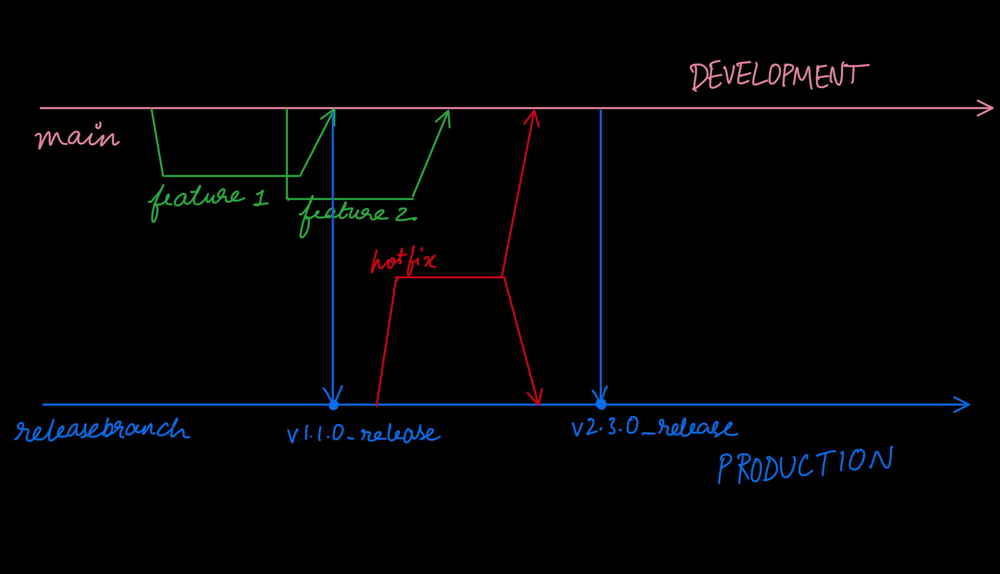

<h1 align="center"> Welcome to quote_server 👋 </h1>

 A simple backend service with authentication 

> CI/CD setup for a javascript application  

## Table of Contents
- [Setup Instructions](#setup-instructions)
- [Usage](#usage)
- [Branching Strategy](#branching-strategy)
- [Author](#author)
- [Show Your Support](#show-your-support)

## Setup Instructions
- Install GitHub Runner to the environment of your choice.
  - Make sure the environment has docker and kubernetes installed. 
  - I am going with the assumption that the environment is unix based as there are shell commands to be executed during build/deploy processes.
  - Make sure the ports 80 and 8080 are available on the environment.
- Make sure that you have access to the Runner device as the deployments happen locally to it.
- Make sure to have a way to send REST API requests to the environment to have access to the application.
- All the automation actions take place after merges to relevant branches. 

## Usage
- The quote_server is an application that sends back random quotes from my favourite books on a successful, authenticated GET request to the relevant port.
  - There are two versions of the application running parallel; development at port 80, and production at port 8080.
- The word "environment" will be used to refer to development and production and not the Runner from now on.
- The application is packaged as a docker image with the version number as a tag.
  - Development builds are of the format v(x.x.x). Release versions have "release" appended at the end.
    - *We can also have it in reverse with "development" appended to non-release builds if required.*
- Deployments to these environments are set up to happen automatically on successful merges to the protected branches "main" and "releasebranch" respectively.
- Pushes to these branches are restricted, allowing them only after an approved Pull Request.
- main is designated as the development branch and any branch can be merged to it, triggering a deployment to the "development" environment.
- releasebranch is the designated production branch. Only merges from branches with the prefix `release_*` or `hotfix_*` trigger deployments to the "production" environment.
- Before any merge a `status_check` is to be run successfully. This lists out the files which were added/changed before commit.
  - The application sends back valid responses on requests to `/quote`, `/version` and `/hash` only. Be sure to pass the API_KEY of the respective environment as a header in the request.
- It is recommended to utilize the project [typeface-assignment](https://github.com/users/satyapraneet63/projects/2) to track your commits along with your task/feature as a commit message for project management.
- The recommended naming convention of the branches is `<developer>/<ticket>/<branch_name>` for clarity.

## Branching Strategy
- My assumption for a project of this type is short development cycles in quick bursts without extensive staging or loadtesting.
  - Short automated(!!!) tests may be integrated before any merge, but there need to be a preproduction before release.
- Feature branches are made from the currently active main branch and merged at the end assuming short work cycles.
- Every merge tags the build using [Semantic Versioning](https://semver.org/) before deployment. The default increment is to the `#patch` number. `#minor` and `#major` increments are to be mentioned in the commit message and are to be regulated by the admin/team lead.
- At a sufficient point, a `release_xxx` branch can be created from main and merged to the releasebranch to trigger a production deployment.
- There is a provision for hotfixes into production, though only for branches with the format `hotfix_*` which also trigger production deployment. Ensure caution and promptly merge these fixes into back main ASAP to prevent the relevant bug from persisting in future builds.
- The branches are enforced to have a linear history so that all commits are up-to-date before merge.
- It falls on the developer to keep their branch up-to-date and their development cycle quick so that conflicts are minimized. Hence, the initial assumption.

## Author
👤 **Satya Praneet**
* Github: [@satyapraneet63](https://github.com/satyapraneet63)
* Mail: [satyapraneet63@gmail.com](mailto:satyapraneet63@gmail.com)

## Show your support
Give a ⭐️ if this project interests you!